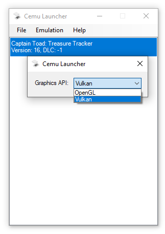
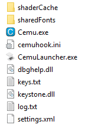

# CemuLauncher
A custom Game Launcher for Cemu. 

Designed for those who require advanced features such as Per-Game Graphics API settings and Pause/Resume/Stop functionality for Cemu. 

## Overview


### Methodology 
* Reads ```settings.xml``` to create baseline configuration
* Creates key-value pair for each Title ID & chosen API
* Switches API before game execution 

### Usage 
See [GUIDE.md](https://github.com/amakvana/CemuLauncher/blob/master/GUIDE.md)
https://github.com/amakvana/CemuLauncher/blob/master/GUIDE.md

## Downloads
https://github.com/amakvana/CemuLauncher/releases/latest

Requires: 
* Latest [Microsoft .NET Framework](https://go.microsoft.com/fwlink/?linkid=2088631)
* Latest [Cemu](https://cemu.info/), setup and [configured](https://cemu.cfw.guide/installing-cemu)
* [Visual C++ 2017 X64 Redistributable](https://aka.ms/vs/16/release/vc_redist.x64.exe)

## Installation
CemuLauncher.exe must be placed alongside Cemu.exe.



CemuLauncher does not require Administrator privileges to run.

## Acknowledgements
Thanks:
* [Cemu Team](https://cemu.info/) - Nintendo Wii U Emulator Developers 
* [Baptiste Roussel](https://www.iconfinder.com/CodMe) - Icons
